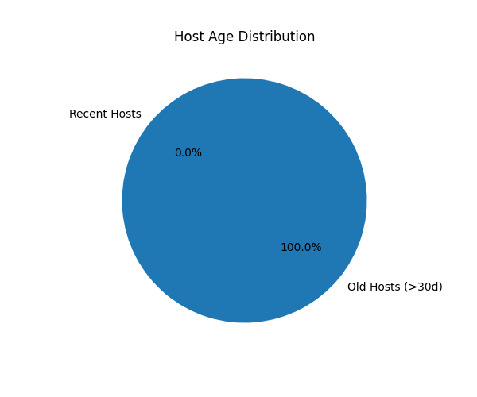
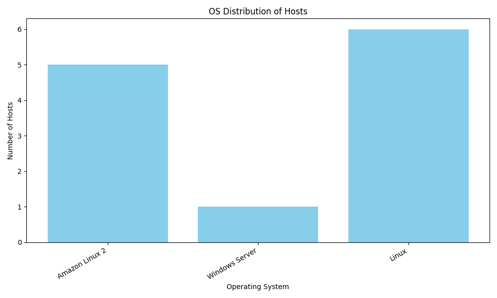

---

# Scalable Host Ingestion Pipeline

This project implements a modular, scalable host ingestion and normalization pipeline that fetches host data from multiple sources (e.g., Qualys, Crowdstrike), normalizes the structure, deduplicates, and persists it into MongoDB. 
The system is designed for easy extension and background task processing.


## 📚 Table of Contents

- [Tech Stack](#-tech-stack)
- [Project Structure](#-project-structure)
- [Event Loop Flow](#-event-loop-flow)
- [Celery + Redis Event Loop](#-celery--redis-event-loop)
- [Getting Started](#-getting-started)
- [Adding New Vendor](#-adding-new-vendor)
- [Visualization](#-visualization)

## 🔧 Tech Stack

* **Python 3.10+**
* **Celery + Redis** — background task queue
* **MongoDB** — database for storing processed hosts
* **Pydantic** — data modeling and validation
* **Docker + Docker Compose** — local orchestration

## 📁 Project Structure

```
project/
│
├── app/                          # Application core
│   ├── main.py                   # Entry point
│   │
│   ├── config.py                 # ENV-based config (fetchers, DB, etc.)
│   ├── loader.py                 # Dynamically loads fetchers based on config
│
│   ├── clients/                  # Vendor-specific API clients
│       ├── base.py               # Abstract base client
│       ├── crowdstrike.py        # Crowdstrike API client
│       └── qualys.py             # Qualys API client

│   ├── models/                   # Pydantic data models
│   │   ├── raw_qualys.py         # Raw Qualys host schema
│   │   ├── raw_crowdstrike.py    # Raw Crowdstrike host schema
│   │   └── unified_host.py       # Final unified schema
│
│   ├── services/                 # Business logic
│   │   ├── normalizer.py         # Vendor-specific normalization
│   │   ├── deduplicator.py       # Host deduplication logic
│   │   └── persistence.py        # MongoDB insert/update logic
│
│   ├── tasks/                    # Background tasks (e.g., Celery)
│   │   └── fetch_and_process.py  # Async pipeline task
│
│   └── utils/                    # General utilities
│       ├── pagination.py         # Pagination helper for APIs
│       
│
├── tests/                        # Pytest test cases
│   ├── test_normalizer.py        # Tests for normalize functions
│   ├── test_deduplicator.py      # Tests for deduplication logic
│   ├── test_persistence.py       # Tests MongoDB upsert
│   └── test_upsert_real.py       # Real upsert tests against live DB
│
├── visualisations/               # Data analysis / reporting
│   ├── plot_os_distribution.py   # Pie chart: OS breakdown
│   ├── plot_host_age.py          # Bar chart: host age analysis
│   └── screenshots/              # Saved plots for review
│       └── *.png
│
├── .env                          # Local environment variables
├── docker-compose.yml            # Services: MongoDB, Redis, API, Celery
├── Dockerfile                    # Build app container
├── pytest.ini                    # Pytest config (markers, paths)
├── requirements.txt              # All dependencies
└── README.md                     # Setup + usage instructions
```

## 🔁 Event Loop Flow

The project uses `asyncio` to coordinate asynchronous data ingestion, normalization, deduplication, and MongoDB persistence.

```text
┌──────────────────────────────┐
│         main.py entry        │
└────────────┬─────────────────┘
             ↓
asyncio.run(_run_async_pipeline())
             ↓
────────────────────────────────────────────────────────
Function: _run_async_pipeline (in fetch_and_process.py)
────────────────────────────────────────────────────────
             ↓
fetchers = load_fetchers()
             ↓
────────────────────────────────────────────────────────
Function: load_fetchers() (in loader.py)
────────────────────────────────────────────────────────
             ↓
Reads config.py:
ACTIVE_FETCHERS = [
  "app.clients.real_qualys.QualysFetcher",
  "app.clients.real_crowdstrike.CrowdstrikeFetcher"
]
             ↓
Uses import_module(...) and getattr(...) to create:
- fetcher1 = QualysFetcher()
- fetcher2 = CrowdstrikeFetcher()
             ↓
Returns list of fetchers
             ↓
────────────────────────────────────────────────────────
Loop:
for fetcher in fetchers:
    async for raw_host in fetcher.fetch_hosts():
        process_host(raw_host)
────────────────────────────────────────────────────────
             ↓
→ First: QualysFetcher.fetch_hosts()
→ Then:  CrowdstrikeFetcher.fetch_hosts()

Both internally call:

    async for host in paginated_fetch(self._fetch_page, batch_size=2):
        yield host

             ↓
────────────────────────────────────────────────────────
Function: paginated_fetch(...) (in pagination.py)
────────────────────────────────────────────────────────
- skip = 0
- calls self._fetch_page(skip, limit)
- yields host one by one
- increments skip and loops again

             ↓
────────────────────────────────────────────────────────
Function: _fetch_page(self, skip, limit)
────────────────────────────────────────────────────────
- Sends POST to API with:
    skip=X, limit=2
- Parses JSON list of hosts
- Yields them one by one

             ↓
🎯 Final result: raw host dicts from all sources

             ↓
Then (per host):
- normalize_* → convert to UnifiedHost
- Check Redis:
    → if key exists → skip
    → else:
        - store key in Redis (with TTL if enabled)
        - upsert_host() → insert/update in MongoDB

```

## 🔄 Celery + Redis Event Loop

Here’s how they interact:

```text
──────────────────────────────────────────────────────
│ Docker Compose starts all project services          │
│ worker: celery -A app.tasks.fetch_and_process ...   │
└────────────────────────────┬────────────────────────┘
                             ↓
Celery worker starts with module app.tasks.fetch_and_process
                             ↓
@task → run_pipeline() is triggered directly (e.g., inside main.py)
                             ↓
asyncio.run(_run_async_pipeline())
                             ↓
Main pipeline steps:
→ load_fetchers()          # Dynamically load all active fetchers
→ fetch_hosts()            # Asynchronously collect data page-by-page
→ normalize                # Convert raw data to UnifiedHost objects
→ Redis check              # Perform deduplication via Redis key
→ if new:
    → Store Redis key
    → upsert_host()        # Insert or update in MongoDB

```
## 🚀 Getting Started

1. **Clone the repository**
2. **Create a `.env` file** from the example and set your API token
3. **Start services**:

```bash
docker-compose up --build
```


## ✅ Adding New Vendor

1. Create a new fetcher in `app/clients/`
2. Inherit from `BaseHostFetcher` and implement `fetch_hosts()`
3. Register it in `ACTIVE_FETCHERS` in `config.py`

## 📊 Visualization

* Run scripts in `visualizations/` to generate analytics
* Export screenshots to `visualizations/screenshots/`

### 🐳 Run from Docker

To run visualization scripts inside the Docker container :

```bash
docker-compose run --rm api python visualisations/plot_host_age.py
```

```bash
docker-compose run --rm  api python visualisations/plot_os_distribution.py
```


### 🕒 Host Age Distribution



### 💻 OS Distribution


